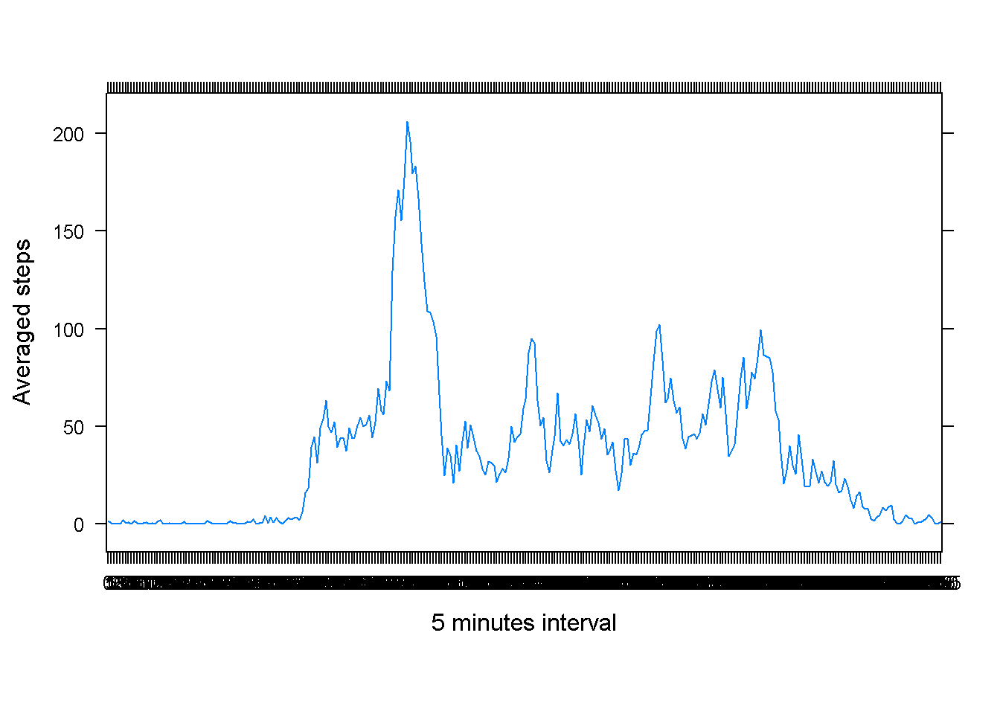
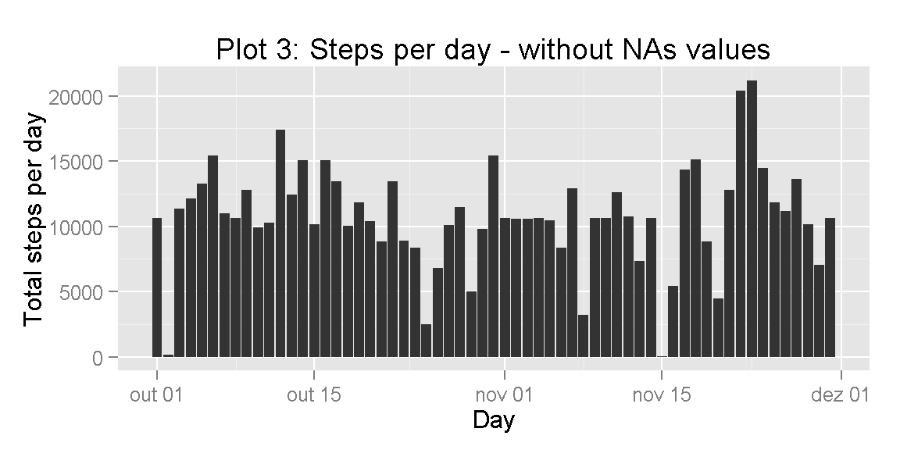
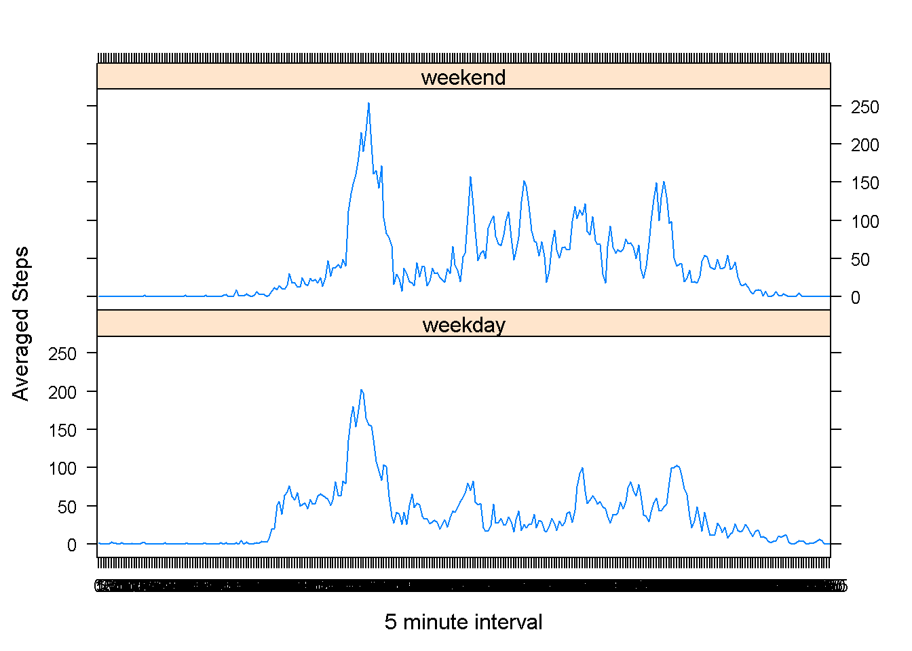

# Reproducible Research: Peer Assessment 1
## Silviolgandrade - nov/14

---

### R procedures


```r
# set work directory
setwd("D:/jhds/jhds_05_Reprodicuble_Research/GitHub/RepData_PeerAssessment1")

# load packages
library(knitr)
library(lubridate)
library(ggplot2)

# Global configs
knitr::opts_chunk$set(echo=TRUE, fig.path='./figures/')
```

---

### Loading and preprocessing the data

Assuming data for analysis in original file "activity.zip" inside the fork repo from RDPeng.


```r
unzip(zipfile="activity.zip")
activity <- read.csv(file = 'activity.csv', stringsAsFactors = FALSE)
activity$date <- as.Date(activity$date, format="%Y-%m-%d")
activity$weekday <- wday(activity$date, label=T,abbr=T)
activity$weekday <- as.factor(activity$weekday)
activity$interval <- as.factor(activity$interval)
days <- as.factor(activity$date)
head(activity)
```

```
##   steps       date interval weekday
## 1    NA 2012-10-01        0     Mon
## 2    NA 2012-10-01        5     Mon
## 3    NA 2012-10-01       10     Mon
## 4    NA 2012-10-01       15     Mon
## 5    NA 2012-10-01       20     Mon
## 6    NA 2012-10-01       25     Mon
```

---

### Question 1: What is mean total number of steps taken per day?

Step 1. Make a histogram of the total number of steps taken each day


```r
histogram <- 
qplot(x=date, y=steps,
      data=subset(activity, complete.cases(activity)),
      stat='summary', fun.y=sum, geom='bar') +
  labs(title='Plot 1: steps per day',
       y='Total steps per day', x='Day')
plot(histogram)
```

 

.

Step 2. Calculate and report the mean and median total number of steps taken per day


```r
# Data per day
daily_activity <-
  aggregate(formula = steps~date, data = activity,
            FUN = sum, na.rm=TRUE)

# Summary statistics
mean_steps <- round(mean(daily_activity$steps), 2)  # Mean
median_steps <- quantile(x = daily_activity$steps, probs = 0.5)  # Median, 50%Q
```

    Mean is 10766.19 and  median is 10765.

---

### Question 2: What is the average daily activity pattern?

Step 1. Make a time series plot of the 5-minute interval (x-axis) and the average number of steps taken, averaged across all days (y-axis)


```r
tempo <- split(x=activity,f=activity$date)
tempo <- tempo[[1]]['interval']

library(lattice)
mediaStep <- tapply(activity$steps, activity$interval, mean, na.rm=T )

xyplot(mediaStep ~ tempo, 
       type="l",
       ylab="Averaged steps",
       xlab="5 minutes interval",
       las=2,
       par.settings=list(layout.heights=list(top.padding=3, bottom.padding=6)))
```

 

.

Step 2. Which 5-minute interval, on average across all the days in the dataset, contains the maximum number of steps?


```r
names(which.max(x=mediaStep))
```

```
## [1] "835"
```

---

### Question 3: Imputing missing values

Step 1. Calculate and report the total number of missing values in the dataset (i.e. the total number of rows with NAs)


```r
# Count the number of NAs
global_NAs <- sum(!complete.cases(activity))
step_NAs <- sum(is.na(activity$steps))

# Calculate the number of missing dates
dates_in_range <- seq.Date(from = min(activity$date),
                           to = max(activity$date),
                           by='1 day')
date_NAs <- sum(!activity$date[complete.cases(activity)] %in% dates_in_range)
```

    Global number of NAs in dataset: 2304

    Total of NAs in step column: 2304

.

Step 2. Devise a strategy for filling in all of the missing values in the dataset.

Step 3. Create a new dataset that is equal to the original dataset but with the missing data filled in.

    Imputation strategy: complete missing cases with the average number of steps from the interval.


```r
interval_activity <- aggregate(formula=steps~interval, data=activity, FUN=mean, na.rm=TRUE)
interval_activity$imputed_steps <- floor(interval_activity$steps)

# Merge
imputed_activity <- merge(activity,
                          interval_activity[,c('interval', 'imputed_steps')],
                          by='interval')

# Replace the NAs
imputed_activity$steps <- ifelse(is.na(imputed_activity$steps),
                                 imputed_activity$imputed_steps,
                                 imputed_activity$steps)

# Clean data
imputed_activity$imputed_steps <- NULL

# Summarize the data by day
daily_imputed_activity <-
  aggregate(formula = steps~date, data = imputed_activity,
            FUN = sum, na.rm=TRUE)

head(daily_imputed_activity)
```

```
##         date steps
## 1 2012-10-01 10641
## 2 2012-10-02   126
## 3 2012-10-03 11352
## 4 2012-10-04 12116
## 5 2012-10-05 13294
## 6 2012-10-06 15420
```

.

step 4. Make a histogram of the total number of steps taken each day and Calculate and report the mean and median total number of steps taken per day. Do these values differ from the estimates from the first part of the assignment? What is the impact of imputing missing data on the estimates of the total daily number of steps?


```r
# Calculate summary statistics
mean_imputed_steps <- round(mean(daily_imputed_activity$steps), 2)
median_imputed_steps <- quantile(x = daily_imputed_activity$steps, probs = 0.5)

#mean_imputed_steps2 <- (daily_imputed_activity$steps)
#median_imputed_steps2 <- median(daily_imputed_activity$steps)
```

    With the clean dataset, we have:

    Mean of data: 1.074977 &times; 10<sup>4</sup>

    Median of data: 1.0641 &times; 10<sup>4</sup>

    There are a few difference between both datasets (with and without NAs).


```r
histogram %+% imputed_activity +
  labs(title='Plot 3: Steps per day - without NAs values')
```

 

---

### Question 4: Are there differences in activity patterns between weekdays and weekends?

Step 1. Create a new factor variable in the dataset with two levels - "weekday" and "weekend" indicating whether a given date is a weekday or weekend day.


```r
# Input a column weekend or weekday
imputed_activity['dayTypeInWeek'] = factor(sapply(imputed_activity$date, function(x){ if (wday(x) == 6 | wday(x) == 7) { "weekend" } else { "weekday"} }))
avgStepdayTypeInWeek = aggregate(steps~interval + dayTypeInWeek, mean, data=imputed_activity)

head(imputed_activity)
```

```
##   interval steps       date weekday dayTypeInWeek
## 1        0     1 2012-10-01     Mon       weekday
## 2        0     0 2012-11-23     Fri       weekend
## 3        0     0 2012-10-28     Sun       weekday
## 4        0     0 2012-11-06    Tues       weekday
## 5        0     0 2012-11-24     Sat       weekend
## 6        0     0 2012-11-15   Thurs       weekday
```
.

Step 2. Make a panel plot containing a time series plot (i.e. type = "l") of the 5-minute interval (x-axis) and the average number of steps taken, averaged across all weekday days or weekend days (y-axis).


```r
library(lattice)
xyplot( steps ~ interval | dayTypeInWeek,
        data = avgStepdayTypeInWeek,
        type="l",
        layout=c(1,2),
        xlab="5 minute interval",
        ylab="Averaged Steps")
```

 

